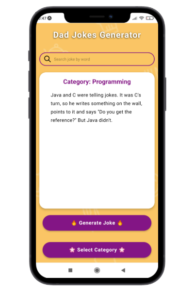
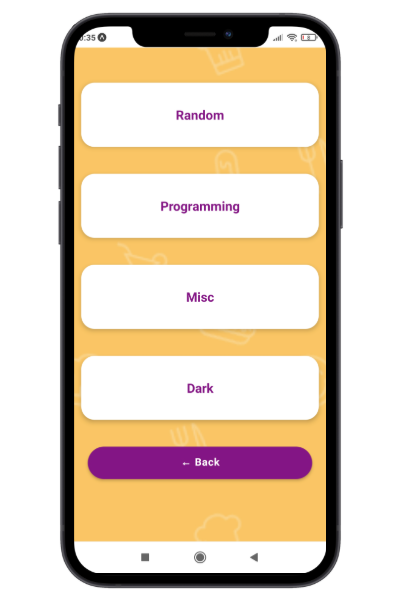

# Dad Jokes Generator

Dad jokes Generator is an application for generating and serving jokes. Layout is made up of several simple components such as a header, a search engine, a container for displaying jokes and reusable buttons.

The application provides several basic functionalities, these are:

1. random generation of jokes
2. generation of jokes according to words typed into the search engine
3. generation of jokes according to categories

For the project, I used an external [Joke API](https://v2.jokeapi.dev/) that provides data with search parameters to specific jokes due to categories and words occurring in jokes.

  
    

## Tech/framework

| Tech                                     | Description                                               |
| ---------------------------------------- | --------------------------------------------------------- |
| [React](https://reactjs.org/)            | Library for building user interfaces                      |
| [React Native](https://reactnative.dev/) | Creating native apps for Android and iOS using React      |
| [Expo](https://docs.expo.io/)            | Framework and a platform for universal React applications |

## Installation

1. Clone a project: `git clone`

2. Install dependencies: `npm install`

3. Install Expo CLI: `npm install --global expo-cli`

4. Run app in development mode using Expo CLI: `npm start`

5. On your Android device, press "Scan QR Code" on the "Projects" tab of the Expo Go app and scan the QR code you see in the terminal or in Expo Dev Tools.

## Available scripts

| Command           | Description                                        |
| ----------------- | -------------------------------------------------- |
| `npm run start`   | Run app in development mode                        |
| `npm run android` | Open app on a connected Android device or emulator |
| `npm run ios`     | Open app in the iOS Simulator                      |
| `npm run web`     | Open app on web                                    |
| `npm run eject`   | Eject CRA                                          |
